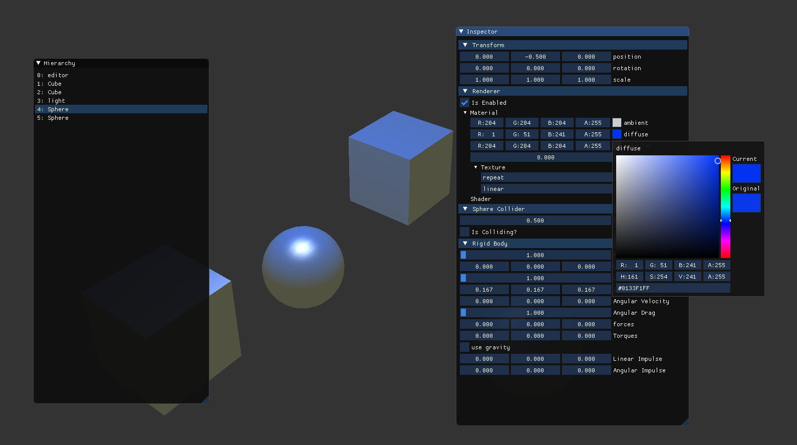

## About
Missan is a game engine written by
[Henrik Syvertsson (LinkedIn)](https://www.linkedin.com/in/henrik-syvertsson-806983197/) 
as part of a project at Karlstad University. 
Missan provides a scripting API with which users can create interactive simulations. 

It is written in C++ with OpenGL (via GLEW) as renderer and GLFW as platform. 
It also uses glm as for maths, 
ImGui for GUI, 
doxygen for documentation, 
and stb for file handling. 

The scripting API is inspired by Unity3D's API, 
so it should look very familiar to those who know it. 
Some features that Missan supports are:
- **Scripting Engine** which allows user-defined scripts to be injected at various stages of the game loop,
e.g. every **Update** or **OnCollisionEnter**. 
- Fundamental Built-in **Components** like Transform, Renderer, Camera, Collider, RigidBody. 
- **Physics Engine** which handles applying forces, and detecting and resolving collisions. 
- **Graphical User Interface** via ImGui
- Importing **Assets**, like textures. 
- Editor showing the Components of the selected GameObject in the Inspector window. 



## Scripting
This example shows how to write a simple first person shooter style
movement and camera script using [Missan scripting API (Link)](https://henkasyvert.github.io/Missan/)
```c++
// Simple script for rotating camera with mouse and moving with WASD. 
// User defined scripts must inherit from Component, which provides
// event-functions that can be overrided, in this case just Update(). 
class FpsMovement : public Component<FpsMovement> {

public: 

   float rotationSpeed = 30.0f;     // How fast the camera rotates, i.e. mouse sensitivity. 
   float pitchConstraint = 89.9f;   // limits maximum pitch (in degrees), i.e. rotation on the x-axis. 

   float moveSpeed = 5;


   // Update is called every frame. Bulk of game logic should happen here. 
   void Update() {

      // handle looking with Camera
      // calculate delta rotation by mouse input. 
      // Use deltaTime for smooth, frame-rate independent movement. 
      float dyRot = -Input::mouseDelta.x * rotationSpeed * Time::deltaTime;
      float dxRot = -Input::mouseDelta.y * rotationSpeed * Time::deltaTime;

      // apply delta rotations and clamp x-axis
      transform->rotation.y += dyRot;
      transform->rotation.x = glm::clamp(transform->rotation.x + dxRot, -pitchConstraint, pitchConstraint);      


      // Handle Movement
      float xAxis = 0;
      float zAxis = 0;
      if (Input::GetKey(Keycode::D)) xAxis += 1;
      if (Input::GetKey(Keycode::A)) xAxis -= 1;
      if (Input::GetKey(Keycode::S)) zAxis -= 1;
      if (Input::GetKey(Keycode::W)) zAxis += 1;

      float dx = xAxis * moveSpeed * Time::deltaTime;
      float dz = zAxis * moveSpeed * Time::deltaTime;

      // apply movement relative to current rotation
      transform->position += dx * transform->right;
      transform->position += dz * transform->forward;

   }
}

...

// how to instantiate GameObject with script:
GameObject player;
player.AddComponent<FpsMovement>();    // our script. 
player.AddComponent<Camera>();         // built-in Component. 
GameObject::Instantiate(&player);      // now player exists in game scene. 
```
## Video Presentation
(In Swedish) where talk about the project and game engines in general. \
[](https://www.youtube.com/watch?v=S2b47aMwBjc)

## The Report
The report (in Swedish), as part of the project course:
[Link to report](https://drive.google.com/file/d/1UEbyQDgeKQjmjQmAAX_eAy41uurMqaDQ/view?usp=sharing)
